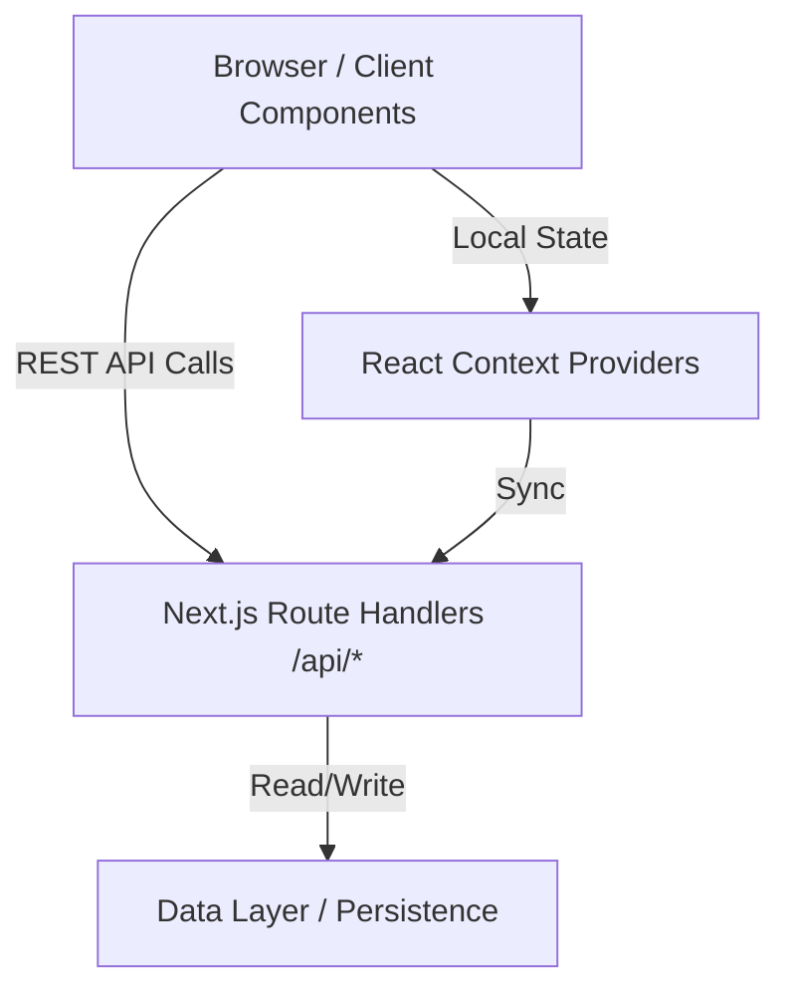

# EduFlow LMS - Architecture Overview

## 1. High-Level Architecture

The EduFlow LMS is built as a **Frontend-first Fullstack application** using the **Next.js 14 App Router**.
It utilizes a **Backend-For-Frontend (BFF)** architecture pattern, utilizing Next.js Server Route Handlers as a proxy to interact with a centralized data store. 



## 2. Directory Structure

```text
app/
├── api/             # Next.js Server Route Handlers (Mock Backend)
│   ├── auth/        # Authentication logic (login, logout, session)
│   ├── courses/     # Course CRUD endpoints
│   ├── enrollments/ # Enrollment CRUD endpoints
│   └── students/    # Student CRUD endpoints
├── components/      # Reusable React UI Components (Cards, Forms, Modals)
├── context/         # React Context Providers (App, Auth, Toast, Settings)
├── dashboard/       # Dashboard Module (Analytics & KPI Cards)
├── students/        # Students Module (CRUD interface)
├── courses/         # Courses Module (CRUD interface)
├── enrollment/      # Enrollment Module (CRUD interface)
├── settings/        # Settings Module (Theme, Reset Data)
├── lib/             # Utility functions, Schema Validation (Zod), Encryption (Jose)
└── globals.css      # Tailwind CSS entrypoint with custom tokens
```

## 3. Core Technologies

- **Framework:** Next.js 14+ (App Router, Turbopack)
- **Language:** TypeScript
- **Styling:** Tailwind CSS (Dark Mode, Glassmorphism, Responsive Design)
- **State Management:** React Context API + Custom Hooks (`useApp`, `useAuth`, `useToast`)
- **Validation:** Zod (Strict schema validation for API routes and Client forms)
- **Authentication:** Mock JWT via `jose` library (HTTP-only cookies)
- **Persistence:** LocalStorage (Hydration-safe architecture)

## 4. State Management (The Data Layer)

State management has been decoupled from individual pages to a global context (`AppContext.tsx`).
- **Initialization:** On component mount, the `AppContext` asynchronously fetches the initial state from the `api/` route handlers.
- **Mutations:** CRUD operations (e.g., `addStudent`) are triggered via Context functions. The Context sends a `POST`/`PUT`/`DELETE` request to the backend API, waits for success, and then updates the React state to reflect the UI changes instantaneously.
- **Consistency:** By keeping `AppContext` as the single source of truth, the Dashboard and all sub-pages reflect the exact same data without prop drilling or duplicate fetching.

## 5. Security & Authentication

Authentication is managed via HTTP-Only cookies.
1. User submits credentials via the `/login` page.
2. The `/api/auth` endpoint validates the payload and generates an encrypted JWT using `jose`.
3. The JWT is stored securely as an HTTP-only cookie, making it inaccessible to XSS attacks.
4. **Middleware (`middleware.ts`):** Before rendering any protected route (`/dashboard`, `/students`), the Next.js middleware intercepts the request, decodes the JWT using `lib/auth.ts`, and redirects unauthorized users back to `/login`.

## 6. Hydration Strategy

React Server Components (SSR) and Client Components must perfectly align during hydration.
Since `localStorage` is not available on the server, direct access during render causes mismatch errors. 
**Solution:**
- Defer all browser-specific API access (`localStorage`, `window`, `Date.now()`) inside `useEffect`.
- Utilize loading states while waiting for the component to mount securely on the client.
