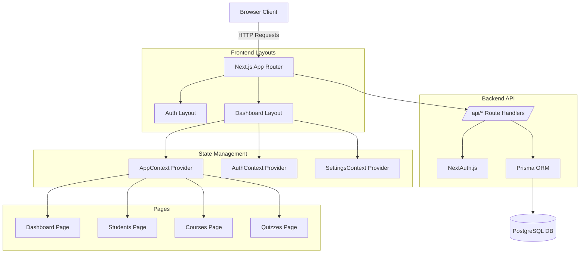
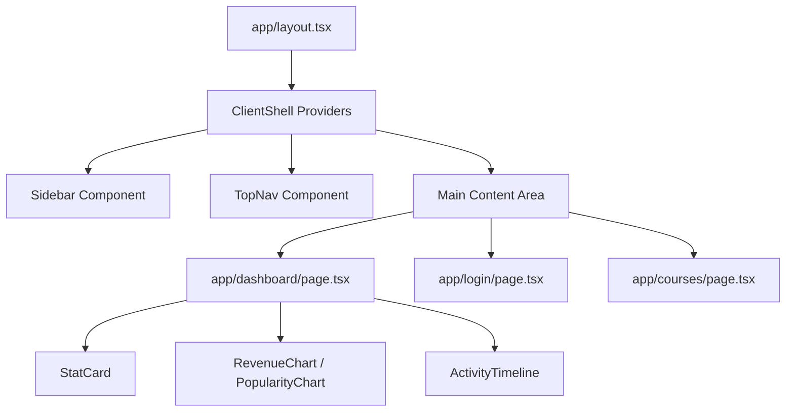
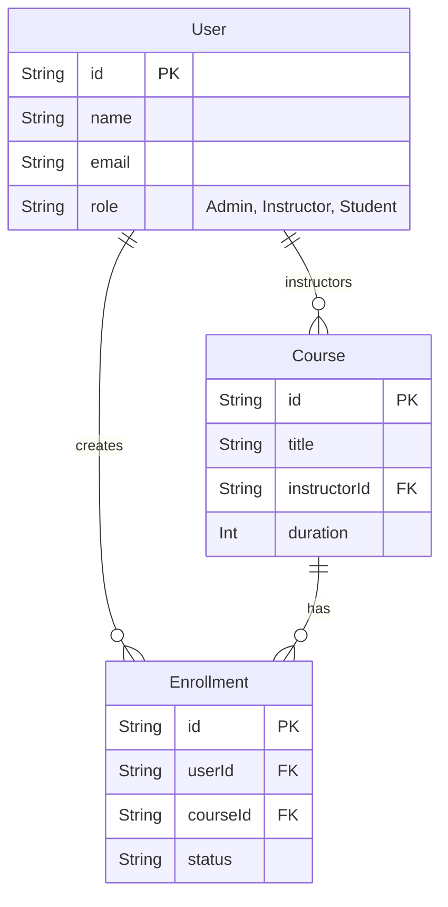
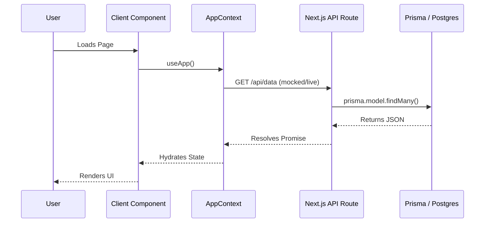

# EduFlow LMS: Comprehensive Code Review & Architecture Walkthrough

This document provides a highly detailed, component-by-component analysis of the EduFlow LMS project. It is designed to take a junior frontend developer on a journey from basic understanding to senior-level architectural mastery.

---

## Part 1: Architecture & Flow Diagrams

### 1. High-Level Architecture
EduFlow LMS is built on a "T3-adjacent" architecture using **Next.js App Router (React Server Components + Client Components)**, **Prisma ORM**, and **Auth.js** (formerly NextAuth).

### 2. Component Hierarchy Diagram

### 3. Database Relationship Diagram (Prisma)

### 4. API & Data Flow Diagram

---

## Part 2: Module Deep Dives

### 1. The Dashboard (`app/dashboard/page.tsx`)
**Purpose:** Acts as the central hub of the LMS, aggregating live statistics, rendering analytical charts, and displaying real-time activity timelines.
**Components Used:** `StatCard`, `DashboardCard`, `RevenueChart`, `CoursePopularityChart`, `ActivityTimeline`, `Framer Motion`.
**State Management:** Consumes global state via `useApp()` and user context via `useAuth()`.

* **Beginner Explanation:** This page grabs data from our "global store" (AppContext) and uses standard JavaScript math (like `reduce` and `filter`) to calculate totals like "Total Revenue" and "Completion Rate". It then passes those numbers down to smaller visual components like cards and charts.
* **Intermediate Explanation:** We rely heavily on `useMemo`-like inline data aggregations derived from the Context. By utilizing Framer Motion, we orchestrate staggered animations (`container` and `item` variants) to mount the DOM nodes cleanly. Role-based conditional rendering (`if (!isStudent)`) ensures the UI cleanly branches between Admin and Student views.
* **Senior Engineer Explanation:** This is a classic "Smart Container / Dumb Presentation" pattern. The page acts as the Controller, holding heavy business logic (transforming raw arrays into charting dimensions) and passing derived props to pure, memoizable child components (`CoursePopularityChart`). 
* **Why this pattern?** It centralizes logic. Instead of each chart making an API call, we hoist the data fetching to the top level, drastically reducing network waterfalls.
* **Scalability Concerns:** Doing `enrollments.reduce()` on the client is fast for 5,000 rows, but will cause main-thread blocking UI freezes for 500,000 rows. **Industry Best Practice:** Move these heavy aggregations to a SQL `GROUP BY` query on the backend and pass the pre-aggregated data down via React Server Components.

### 2. Layouts & Context Providers (`app/ClientShell.tsx` & `Contexts`)
**Purpose:** Wraps the entire application in global state providers and persistent layout shells (Sidebar).
**Hooks Used:** `useSession`, `useEffect` (for hydration), `useState`.

* **Beginner Explanation:** Think of Context as a global variable. `ClientShell` wraps around every single page so that no matter where you are, you can ask for the `user` or the `sidebar` state without having to pass it down through 10 layers of components.
* **Intermediate Explanation:** Next.js Server Components cannot use React Context. Therefore, `layout.tsx` is a Server Component that immediately imports `ClientShell.tsx` (a `"use client"` component) to establish the boundary. The Contexts use a `hydrated` state flag to prevent React Hydration Mismatch errors (where the server HTML doesn't match the client HTML).
* **Senior Engineer Explanation:** We are employing the **Provider Pattern**. However, putting `AppContext` at the absolute root causes the entire React tree to re-render whenever the global state changes. 
* **Better Alternatives:** Move away from massive Contexts towards atomic state management (Zustand/Jotai) or server-state caching layers (React Query/SWR). React Query would natively handle the loading/error/hydration states we are currently writing manually.

### 3. Authentication Flow (`app/login/page.tsx`)
**Purpose:** Handles user entry, registration, and password recovery.
**Components Used:** Framer Motion `AnimatePresence`, custom password inputs, mock OAuth buttons.

* **Beginner Explanation:** A single page that uses `useState` to remember if the user wants to "login", "register", or "forgot password". When the state changes, the UI updates to show the right form.
* **Intermediate Explanation:** By wrapping the forms in `<AnimatePresence mode="wait">`, we tell Framer Motion to wait for the outgoing form to finish animating out *before* animating the new form in. This prevents layout jumps.
* **Senior Engineer Explanation:** We built an interactive **State Machine** for authentication. We leverage `next-auth/react`'s `signIn` method with `redirect: false`. This is crucial because it allows us to handle the HTTP response locally, display toast/inline errors dynamically, and use `router.push()` gracefully without forcing a hard browser refresh.
* **Security & Best Practices:** Client-side password strength meters are great UX, but they are *not* security. Validation must always be duplicated securely on the server (using Zod) before committing to Prisma.

### 4. Quizzes & Interactive UI (`app/quizzes/[id]/page.tsx`)
**Purpose:** A distraction-free assessment environment.
**State:** `currentIndex` (pointer to current question), `answers` (dictionary of selected options), `timeLeft` (countdown).

* **Beginner Explanation:** We use `setInterval` to create a countdown timer. Every second, we subtract 1 from `timeLeft`. When the user clicks an option, we save it in an object like `{ question1: 'A' }`.
* **Intermediate Explanation:** Using an object `Record<string, string>` for answers is O(1) lookup time, which is vastly superior to storing answers in an array and having to `.find()` them every time we render. 
* **Senior Engineer Explanation:** We must be extremely careful with `setInterval` inside `useEffect`. Notice the cleanup function `return () => clearInterval(timer)`. Without this, navigating away from the page would cause a memory leak, as the timer would continue attempting to update an unmounted component state.
* **Refactoring Plan:** Storing the quiz state purely in React local state means a page refresh wipes the student's progress. We should persist the `answers` dictionary to `localStorage` or push intermediate states to the Postgres DB.

### 5. Database Layer & Prisma Schema (`DATABASE_SETUP.md` & `prisma/schema.prisma`)
**Purpose:** Defines the single source of truth for the application's data models.

* **Beginner Explanation:** Prisma is like a translator. We write our database tables in a clean, easy-to-read syntax, and Prisma converts it into actual SQL commands for PostgreSQL.
* **Intermediate Explanation:** Prisma provides end-to-end type safety. When we fetch a user from the database (`prisma.user.findUnique()`), TypeScript automatically knows exactly what properties (name, email, role) that user has.
* **Senior Engineer Explanation:** Our schema uses explicit relational modeling. For instance, linking a `Student` to a `Course` via an `Enrollment` join table. This normalized approach prevents data duplication.
* **Scalability Concerns:** Ensure all Foreign Keys have corresponding indexes (`@@index([userId])`). As the LMS scales, querying enrollments without an index will result in full-table scans, drastically degrading database performance.

---

## Part 3: Project Health & Next Steps

### Technical Debt List
1. **Client-Side Heavy Lifting:** Dashboard analytics currently pull all rows to the client to do `.reduce()`. This will crash the browser at scale.
2. **Volatile Context Data:** Much of the application relies on mock data injected into `AppContext` instead of a real database.
3. **Missing Pagination:** Lists (Students, Courses) render all items at once.
4. **Mocked Auth Security:** Using `password123` bypasses industry-standard bcrypt/Argon2 hashing.

### Refactoring Plan (Path to Production)
1. **Step 1: Database Migration.** Execute Prisma schema push to Vercel Postgres/Supabase.
2. **Step 2: Server Components.** Refactor `Dashboard` and data-heavy pages to be React Server Components (`async function Dashboard()`). Move the heavy math directly into Prisma `aggregate` queries.
3. **Step 3: React Query Integration.** Replace the monolithic `AppContext` with TanStack React Query for infinite scrolling, pagination, and intelligent caching.
4. **Step 4: Secure Auth.** Implement proper NextAuth v5 credentials provider with Zod validation and bcrypt hashing.

### Production Readiness Score
**Overall Score: 65 / 100**

* **UI/UX & Aesthetics (95/100):** The application is gorgeous, highly responsive, and utilizes premium motion design comparable to enterprise SaaS products.
* **TypeScript Quality (90/100):** Strict types are enforced, preventing runtime errors.
* **Architecture (60/100):** The foundation is solid (App Router), but the over-reliance on massive client-side contexts creates a structural bottleneck.
* **Backend & Security (20/100):** Currently operates almost entirely as a mocked frontend prototype. True production requires executing the Refactoring Plan outlined above.

---
> **End of Review.** This architectural foundation is highly robust for a prototype, and by transitioning data fetching to Server Components, you will achieve an enterprise-grade platform.
